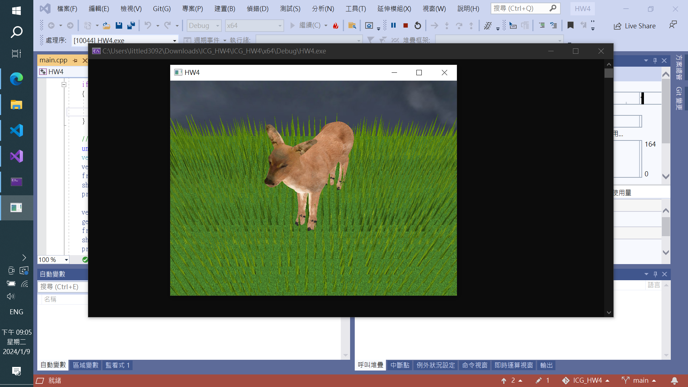

# ICG final project

## Introduction

This is the final project of ICG course. The requirement is to implement a feature with geometry shader. I choose to implement some grass, along with a terrain and a skybox.

## How to run

The project is written using C++ and OpenGL. It can be opened using visual studio 2019. You can open the project file in the following path:

```
ICG_HW4/HW4.sln
```

The project is tested on Windows 10 with integrated graphics card. It should work on other platforms as well.

## Features

### Terrain

The terrain is a simple plane with a texture in the following path:

```
ICG_HW4/HW4/obj/grass.jpg
```

There are grass blades on the terrain. The grass blades are generated using geometry shader. The height of individual grass blades are generated using a random number generator. The grass blades have a texture in the following path:

```
ICG_HW4/HW4/obj/grass_blades.jpg
```

### Skybox

The skybox is a cube with a texture in the following path:

```
ICG_HW4/HW4/obj/skybox_texture.jpg
```

### Camera

The camera is a simple lookat camera defined in function `getView()` in `main.cpp`.

## Keyboard and mouse control

### Keyboard

| Key | Function |
| --- | --- |
| `ESC` | Exit the program |
| `R` | Stop/Start rotating the deer |
| `W` | Stop/Start the wind |
| `G` | Toggle fur on the deer |
| `1` | Make the wind has a larger effect |
| `2` | Make the wind has a smaller effect |
| `3` | Make the wind stronger |
| `4` | Make the wind weaker |

## Screenshots

